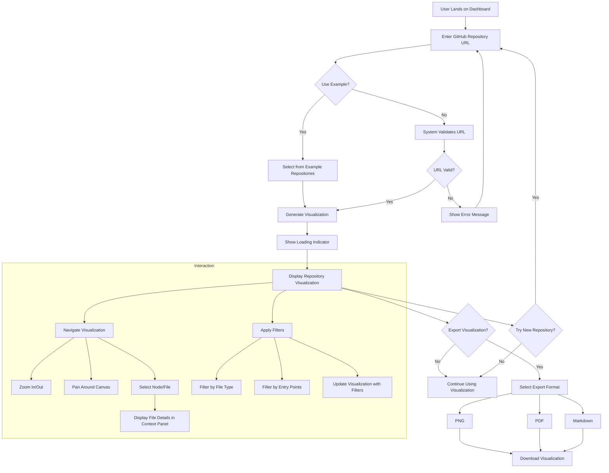

# Source Code Atlas 🌍

A powerful web application for visualizing and analyzing GitHub repository structures, dependencies, and relationships.

## 🚀 Features

- **Repository Structure Visualization**: Interactive visual representation of your codebase's file structure
- **Dependency Mapping**: Visualize relationships between different files and components
- **Multi-Format Export**: Export visualizations in multiple formats:
  - PNG image export
  - PDF document export
  - Markdown documentation
  - Mermaid diagram code
- **Code Preview**: View file contents directly within the application
- **File Explorer**: Browse through repository files with size information
- **Type Detection**: Automatic detection and color coding of different file types
- **Responsive Design**: Works seamlessly on desktop and tablet devices

## User Flow



## 🛠️ Technology Stack

- **Frontend Framework**: React 18.x with TypeScript
- **Build Tool**: Vite
- **UI Components**: shadcn/ui
- **Styling**: Tailwind CSS
- **Visualization**: React Flow
- **Code Highlighting**: CodeBlock component
- **File Export**: html2canvas, jsPDF
- **Routing**: React Router DOM
- **State Management**: React Hooks
- **HTTP Client**: Native Fetch API

## 📋 Prerequisites

Before running the application, ensure you have:

- Node.js 16.x or higher
- npm 7.x or higher
- A modern web browser (Chrome, Firefox, Safari, or Edge)

## 🚀 Getting Started

1. **Clone the repository**
```bash
git clone https://github.com/Zedoman/Visualizer
cd source-code-atlas
```

2. **Install dependencies**
```bash
npm install
```

3. **Start the development server**
```bash
npm run dev
```

4. **Build for production**
```bash
npm run build
```

## 📖 Usage Guide

1. **Viewing a Repository**
   - Enter a GitHub repository URL or owner/repo combination
   - The application will fetch and visualize the repository structure

2. **Navigation**
   - Use the file explorer on the left to browse through files
   - Click on nodes in the visualization to select files
   - Use zoom controls to adjust the view

3. **Visualization Types**
   - Structure: Shows hierarchical file organization
   - Dependencies: Displays file relationships and connections

4. **Exporting**
   - Click export buttons to save visualizations in different formats
   - Available formats: PNG, PDF, Markdown, and Mermaid

## 🔧 Configuration

The application supports the following environment variables:

```env
VITE_GITHUB_TOKEN=your_github_token  # Optional: For increased API rate limits
```

## 🎨 Customization

- **Theme**: Supports light and dark modes
- **Colors**: Customizable through Tailwind configuration
- **Layout**: Responsive design with customizable components

## 📚 API Reference

The application uses the GitHub API to fetch repository data:
- Repository structure
- File contents
- Repository metadata

## 🤝 Contributing

1. Fork the repository
2. Create a feature branch
3. Commit your changes
4. Push to the branch
5. Open a Pull Request

## 📄 License

This project is licensed under the MIT License - see the LICENSE file for details

## 🐛 Known Issues

- Large repositories may take longer to visualize
- Some binary files may not preview correctly
- API rate limiting may affect fetch operations

## 🔮 Future Enhancements

- Support for private repositories
- Advanced dependency analysis
- Custom visualization layouts
- Real-time collaboration
- Integration with more version control systems

## 🤝 Support

For support, please:
1. Check the documentation
2. Search existing issues
3. Create a new issue if needed

## 📊 Performance

- Optimized for repositories up to 10,000 files
- Lazy loading for file contents
- Efficient graph rendering with React Flow

## 🔒 Security

- No sensitive data storage
- Client-side only processing
- Optional API token support

## ✨ Credits

- Built with React and Vite
- Uses shadcn/ui components
- Visualization powered by React Flow
- Icons from Lucide React

## 📱 Compatibility

- **Desktop**: Chrome, Firefox, Safari, Edge (latest versions)
- **Tablet**: iPad OS 13+, Android 9+
- **Mobile**: Responsive design (limited functionality)
